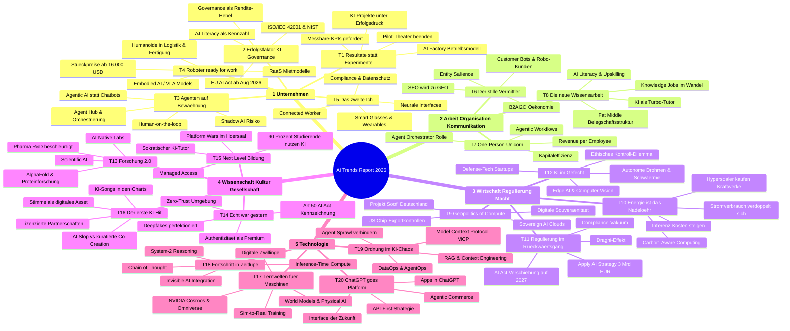

# AI Trends Report 2026 - Mindmap

```mermaid
mindmap
  root((AI Trends Report 2026))
    **1 Unternehmen**
      T1 Resultate statt Experimente
        KI-Projekte unter Erfolgsdruck
        Pilot-Theater beenden
        Messbare KPIs gefordert
        AI Factory Betriebsmodell
      T2 Erfolgsfaktor KI-Governance
        EU AI Act ab Aug 2026
        ISO/IEC 42001 & NIST
        AI Literacy als Kennzahl
        Governance als Rendite-Hebel
      T3 Agenten auf Bewaehrung
        Agentic AI statt Chatbots
        Shadow AI Risiko
        Agent Hub & Orchestrierung
        Human-on-the-loop
      T4 Roboter ready for work
        Humanoide in Logistik & Fertigung
        Embodied AI / VLA Models
        RaaS Mietmodelle
        Stueckpreise ab 16.000 USD
      T5 Das zweite Ich
        Smart Glasses & Wearables
        Connected Worker
        Compliance & Datenschutz
        Neurale Interfaces
    **2 Arbeit Organisation Kommunikation**
      T6 Der stille Vermittler
        SEO wird zu GEO
        B2AI2C Oekonomie
        Customer Bots & Robo-Kunden
        Entity Salience
      T7 One-Person-Unicorn
        Agentic Workflows
        Revenue per Employee
        Kapitaleffizienz
        Agent Orchestrator Rolle
      T8 Die neue Wissensarbeit
        Knowledge Jobs im Wandel
        Fat Middle Belegschaftsstruktur
        KI als Turbo-Tutor
        AI Literacy & Upskilling
    **3 Wirtschaft Regulierung Macht**
      T9 Geopolitics of Compute
        US Chip-Exportkontrollen
        Sovereign AI Clouds
        Projekt Soofi Deutschland
        Digitale Souveraenitaet
      T10 Energie ist das Nadeloehr
        Stromverbrauch verdoppelt sich
        Hyperscaler kaufen Kraftwerke
        Inferenz-Kosten steigen
        Carbon-Aware Computing
      T11 Regulierung im Rueckwaertsgang
        AI Act Verschiebung auf 2027
        Apply AI Strategy 3 Mrd EUR
        Draghi-Effekt
        Compliance-Vakuum
      T12 KI im Gefecht
        Autonome Drohnen & Schwaerme
        Edge AI & Computer Vision
        Defense-Tech Startups
        Ethisches Kontroll-Dilemma
    **4 Wissenschaft Kultur Gesellschaft**
      T13 Forschung 2.0
        Scientific AI
        AlphaFold & Proteinforschung
        AI-Native Labs
        Pharma R&D beschleunigt
      T14 Echt war gestern
        Deepfakes perfektioniert
        Zero-Trust Umgebung
        Art 50 AI Act Kennzeichnung
        Authentizitaet als Premium
      T15 Next Level Bildung
        90 Prozent Studierende nutzen KI
        Sokratischer KI-Tutor
        Managed Access
        Platform Wars im Hoersaal
      T16 Der erste KI-Hit
        KI-Songs in den Charts
        AI Slop vs kuratierte Co-Creation
        Lizenzierte Partnerschaften
        Stimme als digitales Asset
    **5 Technologie**
      T17 Lernwelten fuer Maschinen
        World Models & Physical AI
        Sim-to-Real Training
        Digitale Zwillinge
        NVIDIA Cosmos & Omniverse
      T18 Fortschritt in Zeitlupe
        System-2 Reasoning
        Inference-Time Compute
        Chain of Thought
        Invisible AI Integration
      T19 Ordnung im KI-Chaos
        DataOps & AgentOps
        Agent Sprawl verhindern
        RAG & Context Engineering
        Model Context Protocol MCP
      T20 ChatGPT goes Platform
        Agentic Commerce
        Apps in ChatGPT
        Interface der Zukunft
        API-First Strategie
```
